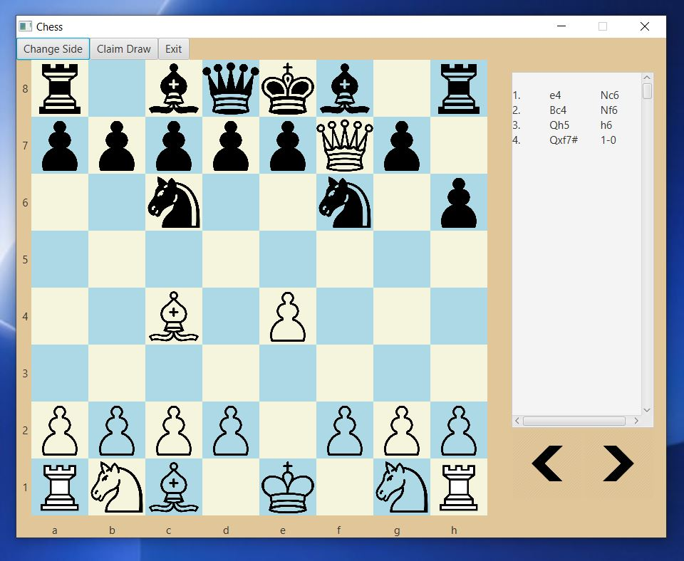

# ChessApp

## Setup
To run the jar file, place it in your command prompt target directory(directory set using cd (pathname))and use the command 'java -jar chess.jar'.

## Classes

### Vector
Basis unit for controlling the geometric aspects of the board. Vital functions include:
* Tracking piece positions
* Returning all peripheral squares for iterative purposes (checking stalemate, etc.)
* Verifying in-bounds status of moves  

### Piece 
Defines each board piece as a subclass and adds the first layer move validation:
* Validates geometrical aspects of each move with various boolean methods that take vector parameters
* Validates moves with reference to the board, including path obstruction and special cases such as En Passant, pawn captures, etc.
* Calls validation within move() method to immediately halt surface-level illegal moves (wrong geometry, pieces in the way)
  
### Board 
Defines and represents the game board with all of the pieces contained and provides multiple additional layers of validation.
* Implements a second move() method, which rules out all illegal moves not ruled out in the first move() method. 
* Determines if the moving player will be put in check in validateMove() through the generation of a test board
* Checks for stalemate by iterating through the calling validateMove() on the peripheral candidate moves of the player to move
* Looks for checkmate in a similar way to stalemate with variation(blocks and double-check are taken into account
* Enables dynamic undoing and redoing through move key tracking 
      
### moveNotator
* Generates the appropriate move notation based on the specified constructor parameters
* Supports move disambiguation (i.e. Rae1 if both rooks can be moved to e1 legally)

### Game
Defines the JavaFX application and controls game graphics:
* Uses a 8x8 label array for the board display -as opposed to keeping track of each piece, the entire game board is iterated through and the appropriate piece image is set on all squares(if it is occupied)
* Synchronizes an array of move strings with the stored boards to enable harmonious move undoing and redoing
* Allows flipping side perspective (resets the game)
* Draws may be claimed according to three-fold repetition and the 50 move rule.
